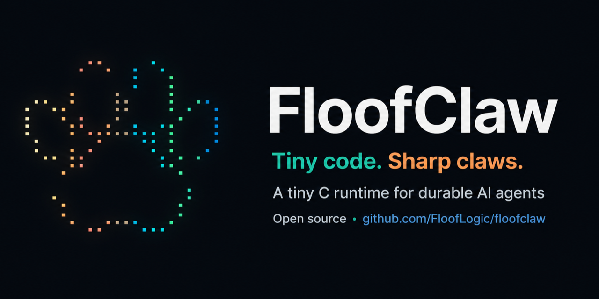
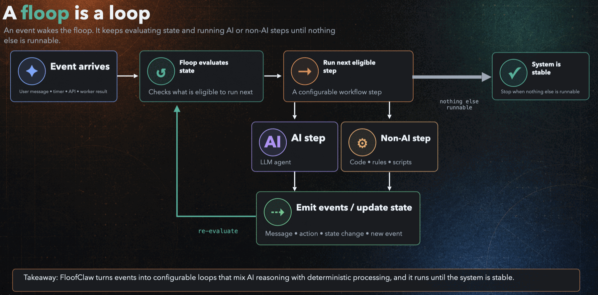

<div align="center">



<p>
  
  
  
  <a href="LICENSE"></a>
</p>

<p>
  <a href="https://floofclaw.com/">Website</a> ·
  <a href="docs/index.md">Documentation</a> ·
  <a href="docs/architecture.md">Architecture</a> ·
  <a href="docs/reference/cli.md">CLI reference</a>
</p>

</div>

**FloofClaw is a tiny C runtime for durable AI agents.** It turns messages,
timers, API calls, and worker results into inspectable event-driven runs that
survive restarts and continue until no work remains.

**~560 KiB all-adapter optimized core · C11 · durable filesystem state · JSON/JSONL by
default · macOS, Linux, and Android ARM64**

## 🚀 Quickstart

The offline path needs a C11 compiler, `make`, and a POSIX userland. It uses
the committed mock-backed `hello` floop, so it needs no account, API key,
gateway, or network connection.

```bash
git clone https://github.com/FloofLogic/Floofclaw.git
cd Floofclaw
make -j4
./bin/fclaw run -h --text "hello"
```

Beginning with v0.30.0, tagged releases include a native macOS arm64 archive;
Linux builds from source in seconds. See
[Prebuilt binaries](docs/getting-started/prebuilt-binaries.md).

Start the always-on local runtime and talk to it from another terminal:

```bash
./bin/fclaw gateway start -h
./bin/fclaw -i -h
```

Stop it later with `./bin/fclaw gateway stop -h`.

Ready for a real model? The guided path is the onboarding wizard:

```bash
./scripts/onboard.sh
```

It walks identity, provider key, floop, channels, the bundled-action
enablement checklist (each action verified live before it is switched on),
and a gateway health probe — needing only bash and `bin/fclaw`. Re-running
it is safe: it keeps existing answers and repairs.

Prefer doing it by hand? Store a key without placing it in shell history—for
example, `./bin/fclaw auth set-stdin -h gemini_key`—then follow the
[provider guide](docs/getting-started/providers.md) to select a provider-backed
floop and profile.

<details>
<summary><b>Optional components</b></summary>

libcurl enables real HTTP providers; OpenSSL 3 enables TLS channels. Some
optional actions and local inspection apps use `python3`, `jq`, or `curl`, but
none sits underneath the C runtime.

Public source releases include the pinned `pluck` source as ordinary files.
Development checkouts that want the `web_read` action can initialize its
public source and build it with:

```bash
git submodule update --init actions/common/web_read/_pluck
bash actions/common/web_read/build.sh
```

</details>

> [!NOTE]
> FloofClaw is not another chatbot framework. It is the engine agents run
> inside when their work needs to survive restarts, stay economical, and be
> accountable over time.

## ✨ Why FloofClaw feels different

### 🐜 Native C, all the way down

**The engine is written entirely in C from scratch.** No Node, Python, JVM,
framework, or language runtime sits underneath it. A package-manager-linked
`make release-small` source build is about **560 KiB**; the downloadable macOS
archive is about **4.34 MiB** because it embeds OpenSSL. Both use the macOS
system libcurl. The mock-only build (`make MOCK_ONLY=1`) can omit both
libraries.

### 📂 The filesystem is the database

**No PostgreSQL, SQLite, Redis, or vector database.** The filesystem is the
durable substrate: append-only event logs are truth, state files are
rebuildable projections, and runs can be replayed after crashes.

### 🤖 Agents are first-class operators

**Every public command speaks structured JSON or JSONL by default.** The
entire runtime is directly composable by agents, shell scripts, and
automation. Human-readable output is still one flag away, but machines are
treated as operators—not an afterthought.

```bash
fclaw view -a <run_id>  # compact JSONL for an agent
fclaw view -h <run_id>  # formatted output for a human
```

### 🔎 Every model call is a glass box

**Every request, response, token record, cache boundary, action call, event,
and stderr artifact is inspectable.** Runs can be viewed, replayed, costed,
and traced without treating an opaque “agent turn” as truth.

## 📏 Small enough to audit

Measurements from 2026-09-04 on arm64 macOS with Apple clang 17. The binary is
the stripped `release-small` artifact produced by
`scripts/build_binary_archive.sh`, with static OpenSSL, system libcurl, and
**all four adapters** (`discord irc telegram ws`), not the default `-O2`
developer build. Run `./scripts/metrics.sh` immediately after the archive
build to reproduce the table; the output names its build profile, adapter set,
and revision.

| What | Measured result |
| --- | ---: |
| Downloadable macOS arm64 all-adapter executable (static OpenSSL) | **4,546,024 bytes (~4.34 MiB)** |
| Runtime C/header source | **43,932 lines** |
| Full provider/TLS build libraries | **2** — libcurl and OpenSSL 3; `make MOCK_ONLY=1` omits both |
| Mock-backed `hello` run | **~0.13 s** |
| Idle isolated gateway RSS | **~8–10 MiB** |
| Quiet supervision review | **exactly 1 model call** |

## 🧭 How it works



A **floop** is a declarative profile of ordered, event-gated steps. The C
kernel walks that profile, validates envelopes, runs jobs, appends events, and
waits for consequences. Product behavior stays in floops, agent packets, and
action contracts; the kernel remains a walker, not a judge.

```text
floops/     shippable loop + agent bundles
actions/    declared capabilities and effect boundaries
runtime/    the small C kernel
workspace/  event logs, projections, and run artifacts
tests/      isolated runtime checks and hermetic smoke coverage
```

## 🪟 Inspect a run

Every triggering event creates a run directory:

```text
workspace/runs/<run_id>/
├── event_log.jsonl       # behavioral truth
├── runstate.json         # durable scheduler envelope
├── state.json            # rebuildable materialized view
├── trace.jsonl           # diagnostic decisions
├── provider_calls/       # numbered raw requests, responses, and metadata
├── agent_outputs/        # raw agent artifacts
└── action_calls/         # numbered action artifacts and stderr
```

The command line exposes the same evidence directly:

```bash
./bin/fclaw view -a <run_id>
./bin/fclaw replay -a workspace/runs/<run_id>/event_log.jsonl
./bin/fclaw usage -a
./bin/fclaw cacheview -a --agent <agent_id> -n 8
```

A run may contain retries, multiple LLM-backed phases, or compaction. Count
`provider_calls/*_meta.json` or the usage ledger for exact model-call usage—not
run directories. `fclaw usage -a` prices the current ledger segment from the
dated assumptions in `config/pricing.json` and marks incomplete estimates
when a provider/model pair is unlisted.

## 🧠 Pick a floop

| Floop | Best for | Model needed? |
| --- | --- | --- |
| `hello` | Offline smoke tests and a zero-account first run | No — mock-backed |
| `openclaw` | Event-driven chat, coding, and tool use with durable memory | Yes |
| `floofclaw` | Long-lived concerns, scheduled reviews, workers, and proactive messages | Yes |

```bash
./bin/fclaw run -h --floop openclaw --text "investigate this bug"
./bin/fclaw gateway start -h --floop floofclaw
```

See [Choosing a floop](docs/getting-started/floops.md) for the complete shipped
set and configuration guidance.

## 🧩 Extend by adding a directory

There is no central registration list and no framework container to wire up.

```text
action          copy into actions/   → restart          → fclaw actions -h
native adapter  copy into adapters/  → make → restart   → fclaw adapters -h
floop           copy into floops/    → select and run   → fclaw floops -h
```

Only a native adapter requires a rebuild because it is C and links into the
same executable. Start with the [extension guide](docs/concepts/extensions.md).

### Works with your MCP servers

Paste the `mcpServers` map you already have for Claude Desktop or Claude Code
into `config/mcp.json` and run the sync:

```bash
./bin/fclaw mcp sync -h    # tools/list → one action per tool → restart
```

FloofClaw *generates* actions from a server's catalog rather than embedding an
MCP client, so each tool arrives as an ordinary action — agent allowlists,
`force_disable`, timeouts, and per-call artifacts all apply, and the binary
contains no protocol code. See [MCP servers](docs/getting-started/mcp.md).

### Sees what you send it

Drop an image, a PDF, or a file into Discord—or send a photo or document with
an optional caption on Telegram—and it reaches the model on the same
`user_message` path as text. Discord accepts up to 10 attachments, 25 MiB
each and 50 MiB per message; Telegram's Bot API download path is capped at
20 MiB per file. Bytes are fetched only inside the bounded model child, never
in the gateway, from the authenticated channel's own file host and nowhere
else. Signed or token-bearing URLs live in a private content-addressed
manifest that no bus, gateway log, or run artifact repeats. What the model can
do with them is the provider's call—Gemini profiles take images, PDFs, audio,
and video; OpenAI-style profiles take images. See
[Discord media](docs/getting-started/discord.md#attachments-and-model-media)
and [Telegram media](docs/getting-started/telegram.md#attachments-and-model-media).

## 🌍 Build targets

FloofClaw builds for macOS, Linux, and Android ARM64. Android produces the same
CLI executable—not an APK library or app-specific wrapper.

```bash
ANDROID_NDK_ROOT="$ANDROID_HOME/ndk/27.0.12077973" \
FCLAW_ANDROID_DEPS_ROOT=/path/to/android-arm64-static-deps \
make android-arm64
```

See the [Android ARM64 build guide](docs/getting-started/android-arm64.md) for
the dependency layout, API selection, and device smoke command.

## 🧪 Tested like a runtime

```bash
make test
```

The routine offline gate runs 49 unit tests, 200 integration tests, fixture
isolation, the local-client lifecycle probe, and a hermetic smoke with mock
provider responses in about a minute. `make test-full` adds rebuild and
feature-selection contracts; release checks run it automatically.
Major-version release preparation adds ASan, UBSan,
small-stack, fuzz, chaos, disk-full/read-only, and thrash campaigns through
`make robustness`.

Read the reproducible history behind those claims in
[Testing investment](docs/performance/testing_investment.md).

## 📚 Go deeper

- [What is FloofClaw?](docs/what_is_floofclaw.md)
- [Architecture](docs/architecture.md)
- [CLI output contract](docs/reference/cli.md#output-contract)
- [Providers](docs/getting-started/providers.md)
- [Discord](docs/getting-started/discord.md)
- [Telegram](docs/getting-started/telegram.md)
- [MCP servers](docs/getting-started/mcp.md)
- [Floops](docs/getting-started/floops.md)
- [Actions](docs/concepts/actions.md)
- [Constitution](docs/concepts/constitution.md)

## 📄 License

FloofClaw is open source under the [Apache License 2.0](LICENSE). Commercial
and noncommercial use, modification, and distribution are permitted under its
terms.
