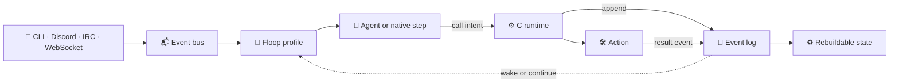

<div align="center">

<h1>🐾 FloofClaw</h1>
<h3>Tiny code. Sharp claws. Every agent step in the open.</h3>

<p>
  Made with ❤️ by <a href="https://flooflogic.com/"><strong>Floof Logic</strong></a> ·
  <a href="https://flooflogic.com/#subscribeForm"><strong>Let’s build something →</strong></a>
</p>

<p>
  
  
  
  <a href="LICENSE"></a>
</p>

<p>
  <a href="https://floofclaw.com/">Website</a> ·
  <a href="docs/index.md">Documentation</a> ·
  <a href="docs/architecture.md">Architecture</a> ·
  <a href="docs/reference/cli.md">CLI reference</a>
</p>

</div>

**FloofClaw is a transparent agent orchestration runtime written from scratch
in C.** It runs agents, actions, and long-lived workflows through a durable
event loop—and leaves an inspectable trail of everything that happened.

> [!NOTE]
> FloofClaw is not another chatbot framework. It is the engine agents run
> inside when their work needs to survive restarts, stay economical, and be
> accountable over time.

## ✨ Why FloofClaw feels different

### 🐜 Native C, all the way down

**The engine is written entirely in C from scratch, with no required
third-party runtime dependencies.** No Node, Python, JVM, framework, or
language runtime underneath it—just a **~635 KiB C binary**. The only optional
native libraries are libcurl for HTTP providers and OpenSSL 3 for TLS
channels.

### 📂 The filesystem is the database

**No PostgreSQL, SQLite, Redis, or vector database.** The filesystem is the
durable substrate: append-only event logs are truth, state files are
rebuildable projections, and runs can be replayed after crashes.

### 🤖 Agents are first-class operators

**Every public command speaks structured JSON or JSONL by default.** The
entire runtime is directly composable by agents, shell scripts, and
automation. Human-readable output is still one flag away, but machines are
treated as operators—not an afterthought.

```bash
fclaw view -a <run_id>  # compact JSONL for an agent
fclaw view -h <run_id>  # formatted output for a human
```

### 🔎 Every model call is a glass box

**Every request, response, token record, cache boundary, action call, event,
and stderr artifact is inspectable.** Runs can be viewed, replayed, costed,
and traced without treating an opaque “agent turn” as truth.

## 📏 Small enough to audit

Measurements from the 0.24.1 source release on arm64 macOS with Apple clang
17. Run `make metrics` to reproduce them at the exact measured revision.

| What | Measured result |
| --- | ---: |
| Stripped executable | **650,664 bytes (~635 KiB)** |
| Runtime C/header source | **39,420 lines** |
| Required third-party libraries | **0** |
| Optional native libraries | **2** — libcurl and OpenSSL 3 |
| Mock-backed `hello` run | **0.124 s** |
| Idle isolated gateway RSS | **~11.6 MiB** |
| Quiet supervision review | **exactly 1 model call** |

## 🚀 Quickstart

The offline path needs a C11 compiler, `make`, and a POSIX userland. It uses
the committed mock-backed `hello` floop, so it needs no account, API key,
gateway, or network connection.

```bash
make -j4
./bin/fclaw run -h --text "hello"
```

Start the always-on local runtime and talk to it from another terminal:

```bash
./bin/fclaw gateway start -h
./bin/fclaw -i -h
```

Stop it later with `./bin/fclaw gateway stop -h`.

Ready for a real model? Store a key without placing it in shell history—for
example, `./bin/fclaw auth set-stdin -h gemini_key`—then follow the
[provider guide](docs/getting-started/providers.md) to select a provider-backed
floop and profile.

<details>
<summary><b>Optional components</b></summary>

libcurl enables real HTTP providers; OpenSSL 3 enables TLS channels. Some
optional actions and local inspection apps use `python3`, `jq`, or `curl`, but
none sits underneath the C runtime.

Public source releases include the pinned `pluck` source as ordinary files.
Development checkouts that want the `web_read` action can initialize its
public source and build it with:

```bash
git submodule update --init actions/common/web_read/_pluck
bash actions/common/web_read/build.sh
```

</details>

## 🧭 How it works



A **floop** is a declarative profile of ordered, event-gated steps. The C
kernel walks that profile, validates envelopes, runs jobs, appends events, and
waits for consequences. Product behavior stays in floops, agent packets, and
action contracts; the kernel remains a walker, not a judge.

```text
floops/     shippable loop + agent bundles
actions/    declared capabilities and effect boundaries
runtime/    the small C kernel
workspace/  event logs, projections, and run artifacts
tests/      isolated runtime checks and hermetic smoke coverage
```

## 🪟 Inspect a run

Every triggering event creates a run directory:

```text
workspace/runs/<run_id>/
├── event_log.jsonl       # behavioral truth
├── runstate.json         # durable scheduler envelope
├── state.json            # rebuildable materialized view
├── trace.jsonl           # diagnostic decisions
├── provider_calls/       # numbered raw requests, responses, and metadata
├── agent_outputs/        # raw agent artifacts
└── action_calls/         # numbered action artifacts and stderr
```

The command line exposes the same evidence directly:

```bash
./bin/fclaw view -a <run_id>
./bin/fclaw replay -a workspace/runs/<run_id>/event_log.jsonl
./bin/fclaw usage -a
./bin/fclaw cacheview -a --agent <agent_id> -n 8
```

A run may contain retries, multiple LLM-backed phases, or compaction. Count
`provider_calls/*_meta.json` or the usage ledger for exact model-call cost—not
run directories.

## 🧠 Pick a floop

| Floop | Best for | Model needed? |
| --- | --- | --- |
| `hello` | Offline smoke tests and a zero-account first run | No — mock-backed |
| `openclaw` | Event-driven chat, coding, and tool use with durable memory | Yes |
| `floofclaw` | Long-lived concerns, scheduled reviews, workers, and proactive messages | Yes |

```bash
./bin/fclaw run -h --floop openclaw --text "investigate this bug"
./bin/fclaw gateway start -h --floop floofclaw
```

See [Choosing a floop](docs/getting-started/floops.md) for the complete shipped
set and configuration guidance.

## 🧩 Extend by adding a directory

There is no central registration list and no framework container to wire up.

```text
action          copy into actions/   → restart          → fclaw actions -h
native adapter  copy into adapters/  → make → restart   → fclaw adapters -h
floop           copy into floops/    → select and run   → fclaw floops -h
```

Only a native adapter requires a rebuild because it is C and links into the
same executable. Start with the [extension guide](docs/concepts/extensions.md).

## 🌍 Build targets

FloofClaw builds for macOS, Linux, and Android ARM64. Android produces the same
CLI executable—not an APK library or app-specific wrapper.

```bash
ANDROID_NDK_ROOT="$ANDROID_HOME/ndk/27.0.12077973" \
FCLAW_ANDROID_DEPS_ROOT=/path/to/android-arm64-static-deps \
make android-arm64
```

See the [Android ARM64 build guide](docs/getting-started/android-arm64.md) for
the dependency layout, API selection, and device smoke command.

## 🧪 Tested like a runtime

```bash
make test
```

The routine offline gate runs 32 unit tests, 139 integration tests, fixture
isolation, the local-client lifecycle probe, and a hermetic smoke with mock
provider responses. Major-version release preparation adds ASan, UBSan,
small-stack, fuzz, chaos, disk-full/read-only, and thrash campaigns through
`make robustness`.

Read the reproducible history behind those claims in
[Testing investment](docs/performance/testing_investment.md).

## 📚 Go deeper

- [What is FloofClaw?](docs/what_is_floofclaw.md)
- [Architecture](docs/architecture.md)
- [CLI output contract](docs/reference/cli.md#output-contract)
- [Providers](docs/getting-started/providers.md)
- [Discord](docs/getting-started/discord.md)
- [Floops](docs/getting-started/floops.md)
- [Actions](docs/concepts/actions.md)
- [Constitution](docs/concepts/constitution.md)

## 📄 License

FloofClaw is open source under the [Apache License 2.0](LICENSE). Commercial
and noncommercial use, modification, and distribution are permitted under its
terms.
